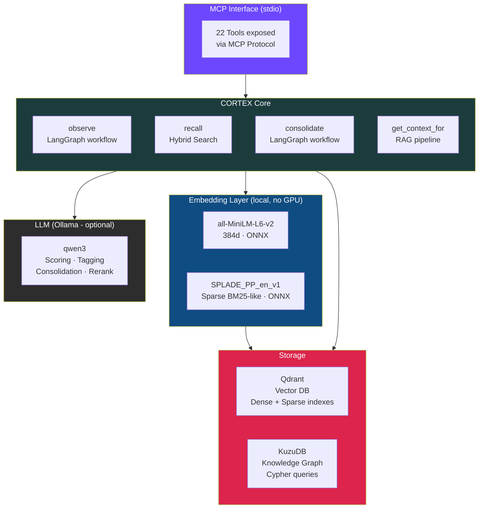
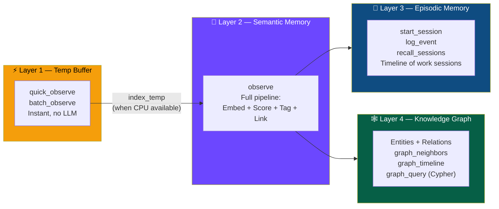
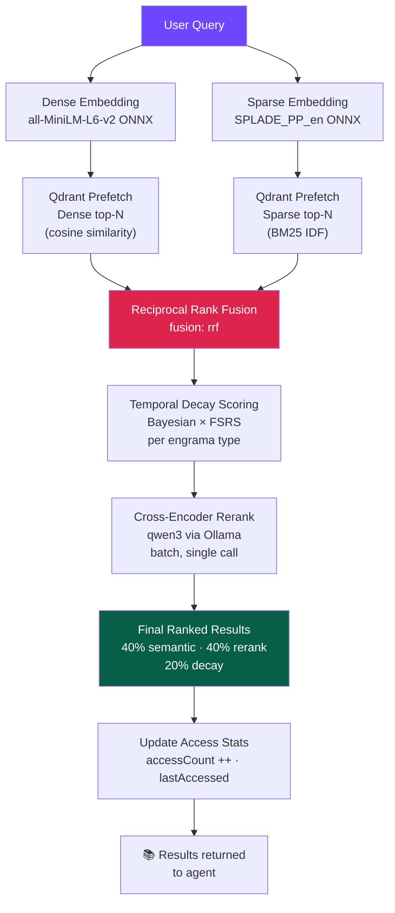
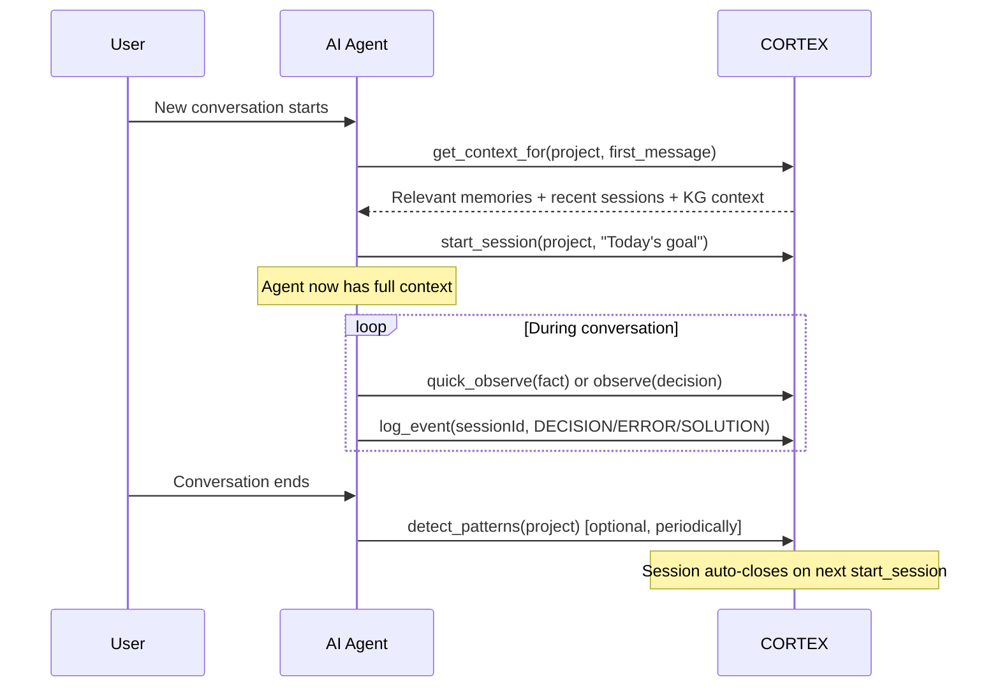

<div align="center">

# 🧠 CORTEX Memory MCP

**A production-grade, long-term semantic memory server for AI agents.**  
Built on [Model Context Protocol](https://modelcontextprotocol.io), LangGraph.js, Qdrant, and local ONNX embeddings.

[](https://modelcontextprotocol.io)
[](https://www.typescriptlang.org/)
[](https://qdrant.tech/)
[](https://github.com/langchain-ai/langgraphjs)
[](LICENSE)

</div>

---

## ✨ What is CORTEX?

CORTEX is a **persistent semantic memory layer** for LLM-based agents. Instead of losing context between conversations, CORTEX lets your AI assistant remember decisions, facts, patterns, and past sessions — and recall them intelligently using **hybrid search** (dense + sparse BM25).

Think of it as a **knowledge base with a brain**: it stores decisions, facts and patterns permanently, surfaces the most relevant ones through intelligent ranking, consolidates duplicates, and uses a Knowledge Graph to understand how entities relate to each other.

> **Design principle**: In software development, memories don't expire with time. A decision made 6 months ago is still valid today. CORTEX never deletes memories due to age — it only surfaces them by relevance. The only way a memory is invalidated is when it is explicitly contradicted by a newer one (via `consolidate`).

### Why CORTEX over naive RAG?

| Feature | Naive RAG | CORTEX |
|---|---|---|
| Search strategy | Dense-only | **Hybrid BM25 + dense + cross-encoder rerank** |
| Memory decay | None | **Bayesian + FSRS (spaced repetition)** |
| Deduplication | None | **LLM-powered consolidation** |
| Session continuity | None | **Episodic memory with event timeline** |
| Entity relationships | None | **Knowledge Graph (Kuzu Cypher)** |
| Operator profile | None | **Persistent preferences + patterns** |
| LLM dependency for embeddings | Required | **100% local ONNX (no GPU needed)** |

---

## 🏗️ Architecture



---

## 📚 Memory Layers

CORTEX organizes memory across **4 complementary layers**:



---

## 🔍 Recall Pipeline

When you call `recall`, CORTEX runs a multi-stage pipeline to surface the most relevant memories:



---

## 🌟 Features

### Core Memory (`observe` / `recall`)
- **Full LangGraph workflow** on `observe`: score → tag → embed → link → upsert
- **Hybrid search**: dense (cosine) + sparse (BM25/IDF) fused via Reciprocal Rank Fusion
- **Cross-encoder reranking** with a local LLM (qwen3) in a single batch call
- **Cross-project search**: queries the project collection + legacy + global in one pass

### Retrieval Priority (not expiration)

> **CORTEX does not delete memories.** Decay is a **retrieval priority signal**, not a forgetting mechanism. A memory with a low decay score still exists — it simply ranks lower if a more recent and frequently accessed memory is equally relevant. If the semantic match is strong enough, any memory surfaces regardless of age.

Two priority engines, chosen automatically by engrama type:

- **Bayesian** (`DECISION`, `FACT`, `ERROR`, `PATTERN`): the priority of technical memories is anchored to importance and access frequency. A high-importance decision holds its position for months without being accessed. It is only *invalidated* — never deleted — when `consolidate` detects a contradiction and marks it `status: superseded`.

- **FSRS-inspired** (`PREFERENCE`, `CONTEXT`): conversational context and preferences get a mild recency boost. Frequently revisited preferences gain stability. Lower-traffic ones rank below newer signals — but are never removed.

### Engrama Types
| Type | Priority Engine | Semantic Weight | Use Case |
|---|---|---|---|
| `DECISION` | Bayesian | 55% | Architecture choices, design decisions |
| `FACT` | Bayesian | 65% | Technical facts, API docs, config |
| `ERROR` | Bayesian | 55% | Bugs found, anti-patterns |
| `PATTERN` | Bayesian | 50% | Recurring behaviors detected |
| `PREFERENCE` | FSRS-inspired | 75% | Operator style preferences |
| `CONTEXT` | FSRS-inspired | 75% | Conversational context |

### Episodic Memory (`start_session` / `log_event` / `recall_sessions`)
- Tracks **work sessions** with structured event timelines
- Event types: `DECISION`, `ERROR`, `SOLUTION`, `INSIGHT`, `CONTEXT_CHANGE`
- Sessions are **searchable by semantic similarity** (fastembed ONNX, no LLM)
- Auto-closes previous open sessions when a new one starts
- Injected into `get_context_for` as recent session summaries

### Knowledge Graph (`graph_*`)
- Built on **KuzuDB** — an embedded graph database with Cypher support
- Auto-populated when `observe` extracts entities from memories
- Query neighbors, timelines, or run arbitrary Cypher queries
- Included in `get_context_for` context block automatically

### Two-Speed Ingestion
```
Fast path (no LLM, no embedding, instant):
  quick_observe → temp_memories buffer

Full pipeline (embedding + LLM scoring):
  observe → project collection (direct)

Batch upgrade (when CPU is available):
  index_temp → processes N pending items in one batch
               1 ONNX call + 1 LLM call + 1 Qdrant upsert
```

### Operator Profile
- Automatically updated by `detect_patterns`
- Stores: coding preferences, active projects, recurring behavioral patterns
- Injected at session start via `get_context_for`

---

## 🚀 Getting Started

### Prerequisites

| Dependency | Version | Notes |
|---|---|---|
| Node.js | ≥ 18 | ESM support required |
| Qdrant | ≥ 1.9 | With sparse vector support |
| Ollama | any | With `qwen3` model pulled |
| TypeScript | 5.3 | Dev only |

### 1. Install Qdrant

```bash
docker run -p 6333:6333 -p 6334:6334 \
  -v $(pwd)/qdrant_storage:/qdrant/storage \
  qdrant/qdrant
```

### 2. Install Ollama + qwen3

```bash
# Install Ollama (https://ollama.com)
ollama pull qwen3
```

### 3. Install CORTEX

```bash
git clone https://github.com/your-org/cortex-memory-mcp.git
cd cortex-memory-mcp
npm install
```

### 4. Configure `.env`

```env
QDRANT_URL=http://localhost:6333
QDRANT_API_KEY=your_api_key_here          # leave empty if no auth
FASTEMBED_CACHE_DIR=./.fastembed_cache    # ONNX model cache
```

### 5. Build & Run

```bash
npm run build
npm start
```

On first startup, CORTEX will download the ONNX models (~130 MB total) and warm them up in the background. All subsequent calls are instant.

### 6. Add to your MCP client (Claude Desktop / Cursor / etc.)

```json
{
  "mcpServers": {
    "cortex-memory": {
      "command": "node",
      "args": ["/absolute/path/to/cortex-memory-mcp/dist/server.js"],
      "env": {
        "QDRANT_URL": "http://localhost:6333",
        "QDRANT_API_KEY": "your_key"
      }
    }
  }
}
```

---

## 📖 Tool Reference

### 🟣 Semantic Memory

#### `observe`
Save a fact, decision, or context to long-term memory. Runs the full LangGraph pipeline: score → tag → embed (dense + sparse) → link to related memories → persist.

```json
{
  "projectName": "my-project",
  "content": "Decided to use PostgreSQL over MongoDB for the user table due to relational integrity requirements"
}
```

**Response:**
```
✅ Engrama guardado.
• ID: 550e8400-e29b-41d4-a716-446655440000
• Importancia: 8/10
• Tipo: DECISION
• Tags: postgresql, database, architecture
Vinculado con 2 memorias relacionadas.
```

---

#### `recall`
Retrieve semantically relevant memories using hybrid search (BM25 + dense + cross-encoder reranking). Results are weighted by relevance and temporal decay.

```json
{
  "projectName": "my-project",
  "query": "which database did we choose for users?",
  "limit": 5
}
```

**Response:**
```
📚 3 memorias para "which database did we choose for users?" en my-project (hybrid BM25+dense, reranked):

1. [DECISION] [imp:8/10] ★8.2 Decided to use PostgreSQL over MongoDB for the user table...
   Tags: postgresql, database, architecture [2 vínculos]

2. [FACT] [imp:6/10] ★6.1 PostgreSQL connection pool configured with max 20 connections
   Tags: postgresql, config

3. [ERROR] [imp:7/10] ★5.9 MongoDB ObjectId serialization caused issues with our REST API
   Tags: mongodb, api, bug
```

---

#### `get_context_for`
**The main RAG entry point.** Call this at the start of every session to inject relevant memory, recent episodes, and Knowledge Graph context into the system prompt.

```json
{
  "projectName": "my-project",
  "message": "Let's continue working on the authentication module",
  "maxItems": 6
}
```

**Response (inject into system prompt):**
```markdown
## 🧠 Memoria CORTEX — Proyecto: my-project
*(6 engramas más relevantes, reranked)*

• [DECISION] We use JWT with 15-min access tokens + 7-day refresh tokens (imp:9/10)
• [ERROR] Refresh token rotation failed when Redis went down — added fallback to DB (imp:8/10)
• [FACT] Auth middleware is in src/middleware/auth.ts (imp:6/10)
...

## 📼 Sesiones recientes
• **12/06/2026** (47 min): Implementar refresh tokens JWT
  → Decidimos usar Redis para blacklist de tokens revocados
  → Solución: fallback a PostgreSQL si Redis no responde

> Usa este contexto como conocimiento previo. No lo repitas textualmente.
```

---

#### `consolidate`
Merge duplicate or contradictory memories using LLM-powered analysis. Superseded memories are marked and excluded from future searches.

```json
{ "projectName": "my-project" }
```

---

#### `detect_patterns`
Analyze recent memories to extract behavioral patterns, coding preferences, and recurring issues. Saves them as high-importance `PATTERN` engramas and updates the Operator Profile.

```json
{
  "projectName": "my-project",
  "limit": 50
}
```

**Response:**
```
🔍 5 patrones detectados en "my-project" → guardados + Operator Profile actualizado:

1. Prefers TypeScript strict mode with explicit return types
2. Always adds error boundaries around external API calls
3. Uses environment variables for all configuration, never hardcodes
4. Writes tests before refactoring existing code
5. Recurrently encounters timezone issues with date handling
```

---

### 🟡 Fast Buffer (no LLM, no embedding)

#### `quick_observe`
Save a memory **instantly** — no LLM, no embedding. Goes to a temporary buffer. Use when you need speed and can index later.

```json
{
  "projectName": "my-project",
  "content": "Found that rate limiter needs to be per-IP not per-user"
}
```

---

#### `batch_observe`
Save multiple memories in one call. All go to the temporary buffer (no LLM, no embedding).

```json
{
  "projectName": "my-project",
  "memories": [
    "Redis maxmemory set to 2gb with allkeys-lru policy",
    "Nginx configured as reverse proxy on port 80/443",
    "PM2 process manager used for Node.js clustering"
  ]
}
```

---

#### `list_pending`
Show what's waiting in the temporary buffer to be indexed.

```json
{ "projectName": "my-project" }
```

**Response:**
```
📥 3 memorias pendientes en temp_memories:

**my-project** (3 pendientes):
  1. [13/06/2026, 08:15] Redis maxmemory set to 2gb with allkeys-lru policy
     ID: abc-123...
  2. [13/06/2026, 08:15] Nginx configured as reverse proxy on port 80/443
     ID: abc-124...
```

---

#### `index_temp`
Process pending buffer memories with full embedding + LLM scoring. Call when CPU is available.

```json
{
  "projectName": "my-project",
  "batchSize": 10,
  "skipScoring": false
}
```

**Response:**
```
🔄 3/3 memorias indexadas en "my-project" con scoring qwen3 (batch):

  • [FACT] imp:7/10 — Redis maxmemory set to 2gb with allkeys-lru policy
  • [FACT] imp:6/10 — Nginx configured as reverse proxy on port 80/443
  • [FACT] imp:5/10 — PM2 process manager used for Node.js clustering

(✅ todo indexado)
```

---

#### `recall_hybrid`
Search **both** the temp buffer (keyword) and indexed memory (semantic) in one call. Best for finding something you saved recently.

```json
{
  "projectName": "my-project",
  "query": "redis configuration",
  "limit": 5
}
```

---

### 📼 Episodic Memory

#### `start_session`
Open a new work session. Records the topic/goal and auto-closes any previously open session.

```json
{
  "projectName": "my-project",
  "context": "Implement OAuth2 Google login flow"
}
```

**Response:**
```
▶️ Sesión episódica iniciada.
⏹️ Sesión anterior cerrada (47 min, 8 eventos)
• ID: 7f3a1c9d-...
• Proyecto: my-project
• Contexto: Implement OAuth2 Google login flow
```

---

#### `log_event`
Record a structured event in the active session.

```json
{
  "projectName": "my-project",
  "sessionId": "7f3a1c9d-...",
  "eventType": "DECISION",
  "description": "Using Passport.js instead of custom OAuth handler — better maintained"
}
```

Event types:
- 🔵 `DECISION` — Architecture or design choice made
- 🔴 `ERROR` — Bug or problem encountered
- 🟢 `SOLUTION` — How a problem was resolved
- 💡 `INSIGHT` — Important realization or learning
- 🔄 `CONTEXT_CHANGE` — Shift in focus or requirements

---

#### `recall_sessions`
Find past sessions relevant to a query using semantic search.

```json
{
  "projectName": "my-project",
  "query": "authentication JWT decisions",
  "limit": 3
}
```

**Response:**
```
📼 2 sesiones relevantes para "authentication JWT decisions" en my-project:

1. 📼 **11/06/2026** (47 min) — Implementar refresh tokens JWT
    🔵 Decidimos usar Redis para blacklist de tokens revocados
    🟢 Fallback a PostgreSQL si Redis no responde

2. 📼 **09/06/2026** (31 min) — Setup inicial del módulo de auth
    🔵 JWT elegido sobre session-based auth por arquitectura stateless
    🔴 Token expiry de 1h causó problemas en mobile — reducido a 15min
```

---

### 🕸️ Knowledge Graph

#### `graph_neighbors`
Show entities directly connected to a node in the Knowledge Graph.

```json
{
  "projectName": "my-project",
  "entity": "PostgreSQL",
  "limit": 10
}
```

**Response:**
```
🕸️ Vecinos de "PostgreSQL" en my-project:

• [USES] → user_table — primary storage for user accounts
• [REPLACES] → MongoDB — chosen for relational integrity
• [CONNECTS_TO] → connection_pool — max 20 connections
• [REFERENCED_BY] ← auth_middleware
```

---

#### `graph_timeline`
View the temporal evolution of an entity — what relationships were recorded and when.

```json
{
  "projectName": "my-project",
  "entity": "Redis",
  "limit": 20
}
```

---

#### `graph_query`
Run a raw Cypher query against the Knowledge Graph (KuzuDB). For advanced users.

```json
{
  "cypher": "MATCH (n:Entity)-[r]->(m:Entity) WHERE n.project = 'my-project' RETURN n.name, type(r), m.name LIMIT 20"
}
```

---

### 🔧 Management

#### `cortex_status`
Get a full system health overview.

```
## 🧠 CORTEX Status
*v3.0.0 — LangGraph.js + Qdrant + fastembed*

**Colecciones activas**: 4
• my-project: 147 engramas
• work (legacy): 18,639 engramas
• social: 896 engramas
• global: 12 engramas

**Buffer temporal (temp_memories)**: ✅ vacío
**Operator Profile**: ✅ (actualizado 13/06/2026)
```

---

#### `get_operator_profile`
Retrieve the persistent operator profile (coding preferences, active projects, detected patterns).

---

#### `get_all_memories`
List all memories for a project, ranked by decay score.

```json
{ "projectName": "my-project", "limit": 20 }
```

---

#### `update_memory`
Update an engrama's content. Recalculates embedding and LLM score.

```json
{
  "id": "550e8400-...",
  "content": "Decided to use PostgreSQL 16 with pgvector extension for embeddings storage"
}
```

---

#### `delete_memory`
Delete a single engrama by ID.

```json
{ "id": "550e8400-..." }
```

---

#### `delete_all_memories`
Delete all memories for a project. **Irreversible** — requires explicit confirmation.

```json
{
  "projectName": "my-project",
  "confirm": true
}
```

---

#### `export_memories`
Export all memories as JSON for backup or migration.

```json
{ "projectName": "my-project" }
```

---

## 💡 Recommended Session Workflow

Here is the recommended pattern for using CORTEX within an AI agent session:



---

## 🧮 Retrieval Priority Score Reference

> **Important distinction**: CORTEX's "decay" is not biological forgetting. It is a **dynamic retrieval priority score** (0–1). A score of 0.1 does not mean the memory is gone — it means it ranks lower than a score of 0.9 in the final result list. All memories are permanent unless explicitly superseded or manually deleted.

### Bayesian Priority (technical memories)

Used for `DECISION`, `FACT`, `ERROR`, `PATTERN`.

```
α = accessCount + importance/2   → grows with use and relevance
β = max(0.1, daysSince × (10 / importance))  → time introduces uncertainty,
                                               but importance resists it
score = α / (α + β)              → E[θ] of the Beta distribution
```

**Example:** A `DECISION` with `importance: 9` stays above 0.85 for ~60 days
without any access. A `FACT` with `importance: 3` drops faster — but
still exists and will surface if semantically matched by a query.

### FSRS-inspired Priority (conversational memories)

Used for `PREFERENCE`, `CONTEXT`.

```
stability      = log(1 + accessCount) × (importance / 5)
priority_score = exp(−daysSince / max(stability, 1))
```

Frequently revisited preferences gain stability and hold their rank.
Less-accessed context fades in ranking — but remains retrievable.

### Combined Score (final ranking)

```
With LLM reranker:   0.40 × semantic + 0.40 × rerank + 0.20 × priority
Without reranker:    semantic_weight × semantic + decay_weight × priority
                     (weights vary by engrama type — see table above)
```

---

## 🛠️ Migration: Adding Sparse Index to Existing Collections

If you have existing Qdrant collections without sparse vectors, use the included migration script:

```bash
# Dry run — see what would be migrated
node migrate_sparse_index.mjs --dry-run

# Migrate all collections
node migrate_sparse_index.mjs

# Migrate a single collection
node migrate_sparse_index.mjs --only=work_memories

# Skip a collection
node migrate_sparse_index.mjs --skip=temp_memories
```

> ⚠️ The script recreates collections (required by Qdrant — sparse vectors cannot be added to existing collections). It exports all points, deletes the collection, recreates it with `sparse_vectors.bm25` declared, then re-imports. Dense vectors are preserved; sparse vectors will be populated on the next upsert.

---

## 📦 Tech Stack

| Component | Technology | Purpose |
|---|---|---|
| Protocol | MCP SDK 1.29 | Expose tools to AI agents |
| Workflow | LangGraph.js 0.0.25 | `observe` & `consolidate` pipelines |
| Vector DB | Qdrant 1.9+ | Dense + sparse storage & search |
| Graph DB | KuzuDB 0.11 | Knowledge Graph with Cypher |
| Dense Embedding | fastembed all-MiniLM-L6-v2 | 384d, ONNX, local, no GPU |
| Sparse Embedding | fastembed SPLADE_PP_en_v1 | BM25-like, ONNX, local, no GPU |
| LLM | Ollama (qwen3) | Scoring, tagging, reranking, consolidation |
| Language | TypeScript 5.3 + ESM | |

---

## 📂 Project Structure

```
cortex-memory-mcp/
├── src/
│   ├── server.ts              # MCP server — all 22 tool handlers
│   ├── bootstrap.ts           # Server initialization
│   ├── services/
│   │   ├── qdrant.ts          # Vector DB client, search, sparse index
│   │   ├── fastembed.ts       # ONNX embedding (dense + sparse)
│   │   ├── ollama.ts          # LLM scoring, tagging, reranking
│   │   ├── decay.ts           # Bayesian + FSRS temporal decay
│   │   ├── episode.ts         # Episodic memory (sessions + events)
│   │   └── kuzu.ts            # Knowledge Graph (KuzuDB + Cypher)
│   ├── graph/
│   │   ├── observe/           # LangGraph observe workflow
│   │   └── consolidate/       # LangGraph consolidation workflow
│   └── types/
│       ├── engrama.ts         # Engrama type definitions
│       └── episode.ts         # Episode type definitions
├── migrate_sparse_index.mjs   # Migration script for sparse indexes
├── test_cortex.mjs            # Integration test suite
├── eval/
│   └── harness.mjs            # Evaluation harness
└── .env                       # Configuration (not committed)
```

---

## 🧪 Running Tests

```bash
npm test
```

The test suite covers: `observe`, `recall`, `quick_observe`, `index_temp`, `recall_hybrid`, `get_context_for`, `consolidate`, `start_session`, `log_event`, `recall_sessions`, and `cortex_status`.

---

## 🤝 Contributing

Contributions are welcome! Please:

1. Fork the repository
2. Create a feature branch (`git checkout -b feature/amazing-feature`)
3. Commit your changes (`git commit -m 'feat: add amazing feature'`)
4. Push and open a Pull Request

---

## 📄 License

MIT — see [LICENSE](LICENSE) for details.

---

<div align="center">

Built with ❤️ for developers who want their AI to actually **remember**.

</div>
